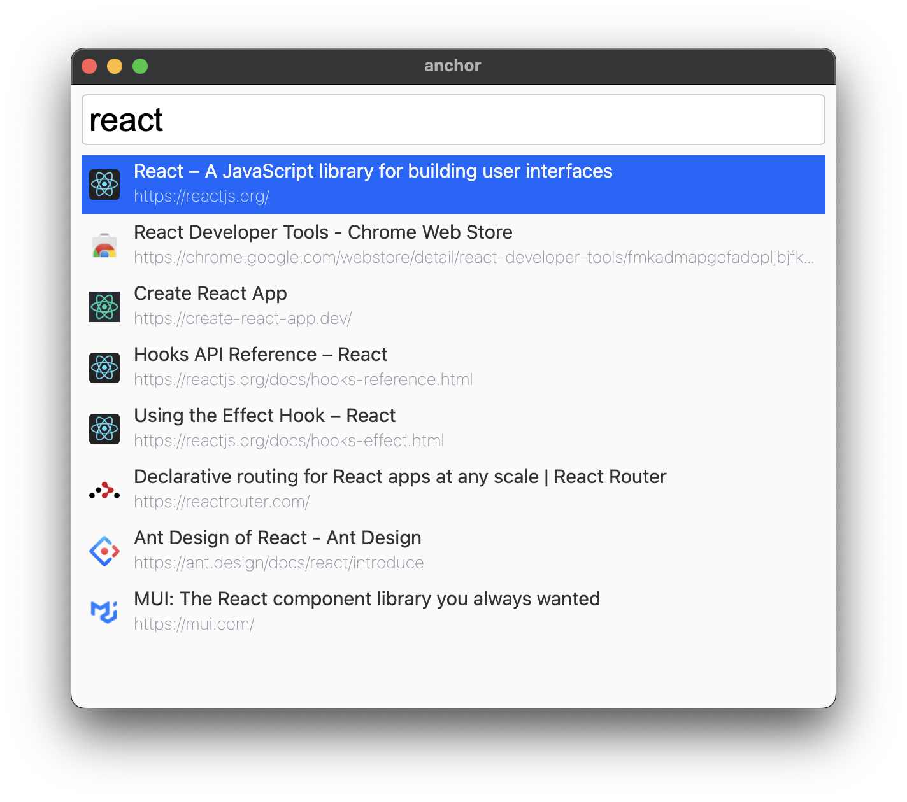

# anchor

[](https://circleci.com/gh/questbeat/anchor)

Tab switcher for Google Chrome.




## Installation

### Download from Chrome Web Store

Go to the [Chrome Web Store page](https://chrome.google.com/webstore/detail/anchor/hgnlmkibblofcjgcljofkcdofkplhlgb) and install extension.

After installing, open Chrome extension settings and setup keyboard shortcut from the bottom right link.


### Build manually

```sh
yarn install
yarn run build
```

Then open Chrome extension settings and drag & drop `build` directory.


## Usage

Launch anchor with keyboard shortcut and input any keywords.
Anchor shows the list of tabs matched to the keywords.

It's also possible to find pages from bookmarks or histories by using following filters.

* `t:(keyword)` - Find from tabs.
* `b:(keyword)` - Find from bookmarks.
* `h:(keyword)` - Find from histories.

If no filters are specified, it's same as `t:` is specified.

Filters can be combined, for example:

* `tb:`  - Find from tabs and bookmarks.
* `tbh:` - Find from tabs, bookmarks and histories.


## License

MIT License: [http://questbeat.mit-license.org/](http://questbeat.mit-license.org/) or see [the LICENSE file](https://github.com/questbeat/anchor/blob/master/LICENSE).
